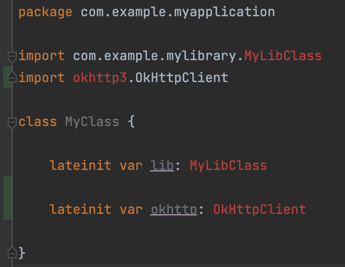

# android-pom-dependency-issue
Sample project illustrating `AGP 7.1+` bug where `IntelliJ/AS` fails to index transitive dependencies
when consuming a `POM` dependency
https://issuetracker.google.com/issues/238057239

## Local repository
The `repo` folder is a local maven repo that contains:
- [`mylibrary`](mylibrary): an regular Android library that just contains [`MyLibClass`](mylibrary/src/main/java/com/example/mylibrary/MyLibClass.kt) and a dependency to `OkHttp`
- [`mylibrarypom`](mylibrarypom): a smapp proxy module that publishes a `POM` having `mylibrary` as a transitive dependency
```xml
<project>
  <groupId>com.example.myapplication</groupId>
  <artifactId>mylibrarypom</artifactId>
  <version>0.0.1</version>
  <packaging>pom</packaging>
  <dependencies>
    <dependency>
      <groupId>com.example.myapplication</groupId>
      <artifactId>mylibrary</artifactId>
      <version>0.0.1</version>
      <scope>compile</scope>
    </dependency>
  </dependencies>
</project>
```

The content of this folder can be regenerated at any time by running `./gradlew publishToLocal`

## The problem
The build always success when run in terminal: `./gradlew build`, but if you open the project with
`IntelliJ/AS` we see the classes are missing:



This was not the case for prior `AGP 7.1` an shown here:
| branch | case | result |
| --- | --- | --- |
| [`master`](../..) | Using `AGP 7.2.1` and a `mylibrarypom` dependency | 🚫 transitive dependencies failed to get indexed |
| [`direct-dependency`](../../compare/direct-dependency) | Using `AGP 7.2.1`, but adding also `mylibrarypom`'s transitive dependency `mylibrary` | ✅ transitive dependencies are reachable |
| [`agp-7.0.4`](../../compare/agp-7.0.4) | Downgrading to `AGP 7.0.4` and a `mylibrarypom` dependency | ✅ transitive dependencies are reachable |

To validate this scenarios, switch branches and run a `Gradle Sync`, then open [`MyClass`](app/src/main/java/com/example/myapplication/MyClass.kt)
